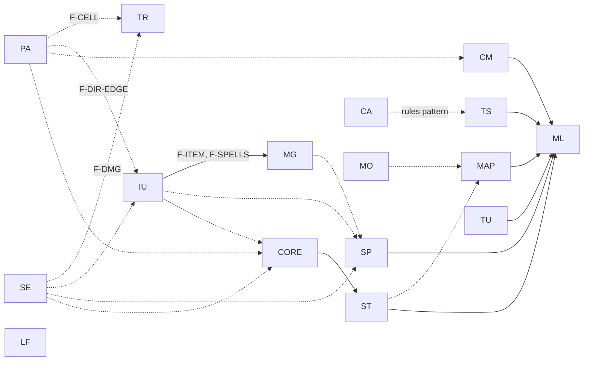

# Migration Backlog

The source of truth for the C-to-Rust port: epics, stories, dependencies, and
status. Test-infrastructure work stays in the
[testing roadmap](../testing-roadmap.md).

Facts below were checked by reading source on 2026-10-09. Size and complexity
ratings are estimates. Re-check a card's facts before starting it.

## How This Works

* An **epic** is a subsystem, usually a few related C files. Each epic has its
  own file under [epics/](epics/) once its stories are planned.
* A **story** ports one C file, or one cohesive part of a large file, and is
  handed to one agent with the
  [delegated-task prompt](../../.github/prompts/delegated-task.prompt.md).
* Only the next few waves are planned in detail. Later epics stay one table row
  until they are about to start.

### Foundations Are Built by the First Port

There is no separate foundation epic. Each epic opens with a **pathfinder**
story that ports a real file *and* builds the shared piece the rest of the
epic needs, with exactly the API that file requires. That keeps foundations
grounded in a working consumer.

* A pathfinder registers its foundation in [Foundations](#foundations).
* **Fan-out** stories reuse a foundation without changing its signatures. If a
  fan-out needs more, it adds a new function in its own file, or stops and
  reports a scope change.
* If a dispatcher must later switch from C to Rust handlers, the pathfinder
  creates the handler files as forwarding stubs into C. Fan-outs then replace
  their own stub and never edit the dispatcher.
* An optional **finish** story deletes the emptied C file and updates docs.
* One-off C callees can be declared `extern "C"` locally. A foundation is only
  for shared abstractions.

### Prompts Stay at the C Edge

Until `command.c` is ported, the C action keeps its blocking prompt
(`d__get_dir`, `get_item`, `get_string`, `get_yes_no`) and passes the answer to
Rust. The Rust side takes the direction, target, or item as a parameter, so it
can be tested without a terminal. The C file shrinks to a prompt shim, and the
shims are removed later by the Terminal & UI and Main Loop epics.

Prompts in the middle of an effect, such as spell direction prompts, need a
Rust-callable seam. The first story that hits one builds it.

### Story Card Format

```markdown
### XX1. Title (pathfinder: F-NAME | fan-out | finish)

Status: open. Depends on: XX0 (solid), YY2 (recommended).
Size: S. Complexity: Medium. Agent: standard.

Owns: files this story may edit.
Must not touch: files owned by other open stories.

Behavior: what moves to Rust, and which C ABI stays unchanged.
Foundation: (pathfinders only) what it builds and the minimal API.

Acceptance checks:
* Observable, testable outcomes with a verification level (L0-L3).

Out of scope: adjacent behavior that stays in C.
```

Verification levels L0-L3 are defined in the
[testing roadmap](../testing-roadmap.md#verification-levels).

### Size, Complexity, and Agent Choice

| Rating | Meaning |
| --- | --- |
| Size S | Under ~100 lines of effective logic. |
| Size M | ~100-300 lines. |
| Size L | ~300-600 lines. Consider splitting. |
| Size XL | Over ~600 lines. Must be split before handoff. |
| Complexity Low | Local logic, few globals, no prompts, no calls into other subsystems. |
| Complexity Medium | Shared C globals, RNG, or output-only IO. Calls retained C via FFI. |
| Complexity High | Prompts, many subsystems, death or level change, pointer ABIs, or subtle legacy rules. |

| Agent | Use for |
| --- | --- |
| Light | S/Low data or mechanical ports, finish stories. |
| Standard | S or M with Low or Medium complexity. |
| Strong | Any High complexity, any L, and every pathfinder. |

If a story feels too large when picked up, split it and give the parts new IDs
(for example `IU5a`, `IU5b`).

### Rules for Parallel Agents

* **One story, one branch or worktree.** Edit only owned files. Needing any
  other file is a scope change: stop and report it.
* **Keep every C ABI.** Exported names, argument types, and pointer contracts
  stay the same, so unported callers are unaffected.
* **Shared files:**
  * `CHANGELOG.md`: one bullet under **Unreleased**, prefixed `Internal:`
    unless player-visible. Keep both sides on merge conflicts.
  * Module registration (`lib.rs`, `player_action.rs`, `mod.rs`): add only
    your own `mod`/`pub use` lines.
  * C headers: remove prototypes only for functions you ported. Never change
    signatures.
  * C files shared by several stories (for example `traps.c`): delete only
    your own functions.
  * Backlog and epic files: update only your card's `Status:` line. The
    coordinator updates graphs and the Foundations table.
  * Do not edit the testing roadmap.
* The `Makefile` finds C sources with `find`, so deleting a `.c` file needs no
  Makefile edit. Its stale `.o` survives `make clean`; delete it by hand or
  run a clean checkout before `make check`.
* Report RED, GREEN, `make check`, and unverified boundaries as the prompt
  requires. Rust tests plus a link do not prove C callers or gameplay.

### Per-Story Checklist

1. Read the C source. List globals, callees, prompts, and RNG calls.
2. RED: failing tests that describe current behavior. Inject RNG with
   `_with_rng`. Serialize and reset any test that touches shared globals.
3. GREEN: port with behavior parity. Add `extern "C"` wrappers for C callers.
4. REFACTOR with tests green.
5. Delete the ported C functions, or reduce the file to a prompt shim.
6. `make check`, changelog bullet, update your `Status:` line.

### Behavior Changes

Preserve legacy behavior, including bugs, unless a card says to fix it. Fix
only trivial, obvious bugs, and record any behavior change in `CHANGELOG.md`.
If unsure, ask the navigator.

## Foundations

| ID | What | Built by | Reused by | Status |
| --- | --- | --- | --- | --- |
| F-CELL | Typed Rust access to `cave`/`t_list` cells, bounds checks, plus a locked, resettable test map. Existing module-local accessors in `dungeon/trap/globals.rs` and `player_action/movement/globals.rs` stay as they are. | PA1 | PA, TR, LF4, later MAP | planned |
| F-DIR-EDGE | Prompt-at-edge pattern for directional actions, plus shared door state transitions. | PA2 | PA7-PA12, IU4 | planned |
| F-DMG | Rust wrappers around C `take_hit`, `py_bonuses`, `prt_stat_block`, and `inven_damage` with documented contracts. | SE1 | SE2, TR, later MG, SP | planned |
| F-TRAP-DISPATCH | Rust `hit_trap` dispatcher with per-group handler files forwarding to C. | TR1 | TR2-TR6 | planned |
| F-ITEM | Handle to a C-selected inventory item, plus the consume lifecycle (identify, destroy one, remaining message). | IU1 | IU2-IU6, later MG, ST | planned |
| F-SPELLS | Rust `extern "C"` declarations for the `spells.h` APIs that ports call. | IU1 | IU, later MG | planned |
| F-CASINO-RULES | Pattern for pure casino rules with injected RNG, called from the C UI. | CA1 | CA2, CA3 | planned |
| F-CASINO-IO | Injectable casino input and drawing seam, plus shared `bet`/`gld` session state. | CA4 | CA5-CA7 | planned |
| F-CLOCK | Injectable wall clock for operating-hours checks. | LF6 | later ML | planned |

Already available: message capture ([message.rs](../../src/message.rs)),
seedable C-facing RNG ([rng/](../../src/rng/)), headless terminal doubles
([tests/support](../../tests/support/README.md)), equipment access
([equipment.rs](../../src/equipment.rs)), and player data accessors
([player/data.rs](../../src/player/data.rs)).

Known gap: some Rust code calls `thread_rng()` directly (`managed_to_hit`,
movement confusion), so the seeded C-facing RNG does not control those rolls.
The first story that needs deterministic results there should add a
`_with_rng` path.

## Epics

| ID | Epic | C files | Size | Detail |
| --- | --- | --- | --- | --- |
| PA | Simple player actions | `player_action/` search, close, stairs, light, refill, rest, look, jam, open, disarm, tunnel, bash | 12 x S-M | [player-actions.md](epics/player-actions.md) |
| TR | Trap activation | `traps.c` | L | [trap-activation.md](epics/trap-activation.md) |
| SE | Status effects | `effects.c`, `player/hunger.c` | 2 x M | [status-effects.md](epics/status-effects.md) |
| IU | Item use | eat, quaff, read, aim, use staff, drop | 6 x S-L | [item-use.md](epics/item-use.md) |
| CA | Casino | `casino/` | 4 files, M-L | [casino.md](epics/casino.md) |
| LF | Leaf modules | store doors, `floor.c`, `graphics.c`, `unix.c`, `loot.c`, `help.c`, `kickout.c` | 7 x S | [leaf-modules.md](epics/leaf-modules.md) |
| MG | Magic schools | `magic/*.c`, `use_magic.c`, `blow.c` | 5 x S-M, 2 x L | Not yet planned |
| SP | Spells | `spells.c` (2,939 lines, ~9 function groups) | XL | Not yet planned |
| TS | Town services | `town_level/enter_bank.c`, `enter_house.c`, `quest.c` | M-L | Not yet planned |
| MO | Monsters | `generate_monster.c`, `monsters.c`, `creature.c` | M, S, XL | Not yet planned |
| MAP | Map generation | `generate_map/*.c`, `dungeon/light.c` | 6 x S-M | Not yet planned |
| CM | Combat & movement | `combat/ranged.c`, `attack.c`, `move.c` | 3 x M | Not yet planned |
| CORE | Player & inventory core | `player.c`, `inventory/inven.c`, `equip.c`, `misc.c` | M, XL, M, XL | Not yet planned |
| ST | Stores & economy | `stores.c`, `trade.c`, `blackmarket.c` | XL, L, M | Not yet planned |
| TU | Terminal & UI | `io.c`, `screen.c`, `term.c` | 3 x M | Not yet planned |
| ML | Main loop & startup | `main_loop/`, `main.c`, `init/`, `pregame/*.c`, `death.c`, `files.c`, `wizard.c`, `c.c`, `debug.c` | Mixed, `wizard.c` XL | Not yet planned |

Planning notes for epics that are not yet planned:

* **MG:** `chakra.c` has no prompts, so it is a good pathfinder. Other schools
  ask for a direction mid-effect and need a Rust-callable direction seam
  (pathfinder: first prompting school). `use_magic.c` owns the spell chooser
  and dispatches into every school, so port it last.
* **SP:** not a prerequisite for item use or magic; ports call retained C
  spell functions via F-SPELLS. Split by function group; shared static helpers
  (`get_flags`, `za__*`, `zm__*`) need one owner.
* **TS:** bank, house, and quest mix rules with `get_yes_no`/`get_com`
  prompts. Extract rules first, as in CA. Bank display helpers are already
  Rust; operations are not.
* **MO:** port `generate_monster.c` before map rooms, dungeon, and town, which
  call it. `creature.c` and `monsters.c` share interfaces; coordinate them.
* **CM:** port combat for parity. The
  [combat proposal](../proposals/combat-system-specification.md) is a redesign
  and is not the port target. Movement continues from the testing roadmap's
  MV1/MV2.
* **CORE:** `damroll` (77 call sites), `take_hit` (53), `inven_destroy` (21),
  `get_item` (18), and `py_bonuses` (19) have high fan-in. Consumers wrap them
  first (F-DMG, F-ITEM); port the C bodies last.
* **TU/ML:** the input seam built here removes the C prompt shims left by
  earlier epics.

### Epic Dependency Graph

Solid arrows are hard dependencies. Dashed arrows reuse a foundation and are
recommended, but the later epic can start by calling retained C instead.



### Story Waves

Stories in the same wave can run concurrently. A wave starts per story as soon
as that story's solid dependencies are done; waves are not global barriers.

| Wave | Stories |
| --- | --- |
| 1 | PA1, PA4, PA5, PA6, SE1, SE3, IU1, CA1, LF1-LF7 |
| 2 | PA2, PA3, TR1, SE2, SE4, IU2, IU3, IU6, CA2, CA3, CA4 |
| 3 | PA7-PA12, TR2-TR6, IU4, IU5, CA5, CA6 |
| 4 | TR7, CA7; plan MG, CM, and TS in detail |

## Completed Work

Ported before this backlog existed. A Rust module's presence does not mean its
subsystem is fully migrated.

* `pascal.c` helpers → [pascal.rs](../../src/pascal.rs).
* RNG with `_with_rng` variants and a seedable C-facing override →
  [rng/](../../src/rng/).
* Text utilities from `text_lines.c` → `text_lines_extern.rs`.
* Trap templates and placement → [dungeon/trap/](../../src/dungeon/trap/); activation remains
  in C (see the [trap activation epic](epics/trap-activation.md)).
* Monster templates → `generate_monster/` (the C file is compatibility glue).
* Hit calculation (`managed_to_hit`) → [combat/fighting.rs](../../src/combat/fighting.rs).
* Movement step decisions and confusion → `player_action/movement/`; C keeps
  side effects.
* Partial: `model/`, `data/`, `conversion/`, `logic/` (wallet, level-up, stat
  modifiers, use-item eligibility), `identification.rs`, `save/`,
  `persistence/`, `player/` (attributes, stats, skills, regeneration),
  `inventory/` display, `pregame/` menus and character creation, bank display
  helpers, and `equipment.rs`.

## Global Variables

C globals (`cave`, `t_list`, `char_row`/`char_col`, `player_flags`,
`inventory_list`, `equipment`, `dun_level`, and others in `variables.h`) are
accessed from Rust through `extern` declarations. Wrap them behind typed
accessors as foundations are built, and pass state explicitly where a port
allows it. Do not move ownership of a global to Rust until its C writers are
ported.
