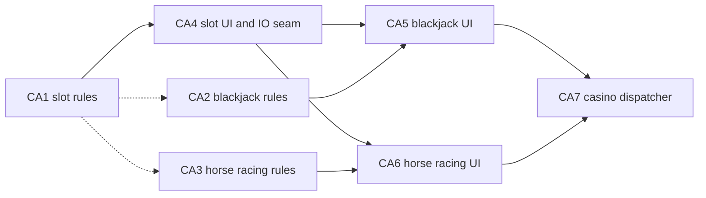

# Epic CA: Casino

Ports [casino/](../../../src/casino/). The old plan called it isolated; it is
only partly so. Each game interleaves its rules with terminal drawing and
input, and all games share `bet`/`gld` session state in
[casino_local.h](../../../src/casino/casino_local.h). The only external caller
is `enter_casino`, from `traps.c`. Back to the [backlog](../backlog.md).

The approach is rules first: extract pure rules with injected RNG and have
the C UI call them. Port the UI loops only after an IO seam exists. The HT1
terminal doubles fail on `get_com`, so they cannot drive casino games yet.

## Story Graph

## Stories

### CA1. Slot Machine Rules (pathfinder: F-CASINO-RULES)

Status: open. Depends on: none.
Size: S. Complexity: Medium. Agent: strong.

Owns: `sm__get_slots` and the payout part of `sm__winnings` in
[slotmachine.c](../../../src/casino/slotmachine.c), a new `src/casino/` Rust
module, registration line in `lib.rs`.

Behavior: reel selection and payout move to Rust `_with_rng` functions. C
keeps animation, the bet loop, and balance updates, and calls Rust for
results.

Foundation: F-CASINO-RULES. The pattern for a pure rules module the C UI
calls: plain inputs, RNG injected, results as values.

Acceptance checks:

* L0: every payout combination returns the C amount.
* L0: seeded reel selection matches the C distribution and is deterministic.

### CA2. Blackjack Rules (fan-out)

Status: open. Recommended: CA1.
Size: M. Complexity: High. Agent: strong.

Owns: the scoring, dealer, and settlement functions in
[blackjack.c](../../../src/casino/blackjack.c), a new Rust blackjack rules
file.

Behavior: port hand evaluation (aces), dealer policy, and settlement,
including split, double, five-card, and blackjack. Hand state is file-static
in C; pass it explicitly to Rust.

Acceptance checks:

* L0: hand totals with aces, dealer stand and hit, and each settlement case
  match C.

### CA3. Horse Racing Rules (fan-out, split candidate)

Status: open. Recommended: CA1.
Size: L. Complexity: High. Agent: strong.

Owns: the stats, odds, prediction, and payout functions in
[horseracing.c](../../../src/casino/horseracing.c), a new Rust horse racing
rules file.

Behavior: port field and odds generation, race simulation results, and
payout for each bet type. `hr__start` mixes simulation and rendering; extract
only the simulation. Split into odds and simulation, then payout, if too
large.

Acceptance checks:

* L0: seeded fields, finishing order, and payouts match C.

### CA4. Slot Machine UI and IO Seam (pathfinder: F-CASINO-IO)

Status: open. Depends on: CA1.
Size: M. Complexity: High. Agent: strong.

Owns: the rest of `slotmachine.c`, the casino Rust module, and the shared
`bet`/`gld` accessors.

Behavior: port the slot loop to Rust behind an injectable casino IO
interface (commands, numeric answers, drawing, delays) and explicit session
state. Production uses the real terminal.

Foundation: F-CASINO-IO. Scripted input that fails when exhausted, recorded
drawing, no real sleeps.

Acceptance checks:

* L1: a scripted session places bets, spins, and quits with the same balance
  and messages as C.
* `slotmachine.c` is deleted.

### CA5. Blackjack UI (fan-out)

Status: open. Depends on: CA2, CA4.
Size: M. Complexity: High. Agent: strong.

Owns: the rest of `blackjack.c` and the Rust blackjack module.

Behavior: port the game loop and card drawing onto F-CASINO-IO.

Acceptance checks:

* L1: scripted hit, stand, double, and split sessions match C balances.
* `blackjack.c` is deleted.

### CA6. Horse Racing UI (fan-out)

Status: open. Depends on: CA3, CA4.
Size: L. Complexity: High. Agent: strong.

Owns: the rest of `horseracing.c` and the Rust horse racing module.

Behavior: port betting, track rendering, and animation onto F-CASINO-IO.
Game time still advances through C `spend_time`.

Acceptance checks:

* L1: a scripted race with each bet type matches C balances.
* `horseracing.c` is deleted.

### CA7. Casino Dispatcher (finish)

Status: open. Depends on: CA5, CA6.
Size: S. Complexity: Medium. Agent: standard.

Owns: [casino.c](../../../src/casino/casino.c), `casino_local.h`, and the
casino Rust module.

Behavior: port `enter_casino`, the menu, money exchange, and kickout check,
keeping the `enter_casino` symbol for `traps.c`.

Acceptance checks:

* L1: a scripted visit enters each game and exits with the C exit messages.
* The `casino/` C files are gone.
