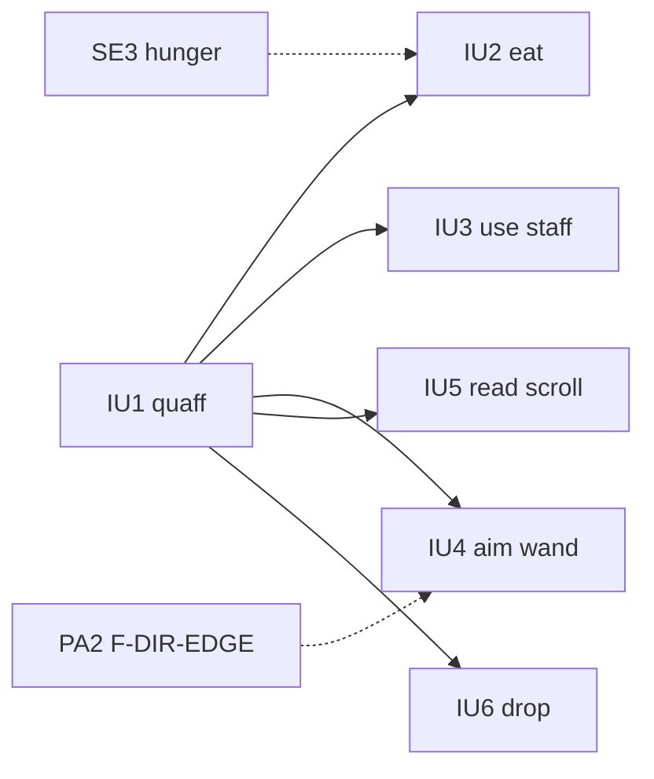

# Epic IU: Item Use

Ports the item-use commands in `src/player_action/`. Spell effects stay in
C `spells.c` and are called through F-SPELLS, so `spells.c` is not a
prerequisite. `use_magic.c` and `blow.c` belong to the MG epic. Back to the
[backlog](../backlog.md).

Rust item-use coverage today is only class eligibility in
[logic/use_item.rs](../../../src/logic/use_item.rs).

## Story Graph

## Stories

### IU1. Quaff Potion (pathfinder: F-ITEM, F-SPELLS)

Status: open. Depends on: none.
Size: M. Complexity: Medium. Agent: strong.

Owns: [quaff_potion.c](../../../src/player_action/quaff_potion.c), a new Rust
quaff module, new F-ITEM and F-SPELLS modules, registration lines.

Behavior: C keeps `get_item` and passes the selected item to Rust. Rust
applies the potion's effects (cases 1-49), calls `spells.c` through F-SPELLS,
then identifies, consumes, and reports the remaining count.

Foundation:

* F-ITEM: a handle to the C-selected inventory node, plus the consume
  lifecycle (identify, destroy one, remaining message).
* F-SPELLS: `extern "C"` declarations for the `spells.h` functions quaff
  uses. Later stories add declarations in their own files.

Acceptance checks:

* L1: a sample from each effect range changes state and messages as C for a
  fixed seed; use doubles where a spell would need the map.
* L1: the potion is consumed and identified as in C, including the last one.
* `quaff_potion.c` contains only the prompt shim.

### IU2. Eat (fan-out)

Status: open. Depends on: IU1. Recommended: SE3.
Size: M. Complexity: Medium. Agent: standard.

Owns: [eat.c](../../../src/player_action/eat.c), a new Rust eat module,
registration line.

Behavior: C keeps item selection. Rust applies food effects, including the
Eyeball of Drong, and calls hunger eating (Rust if SE3 is done).

Acceptance checks:

* L1: plain food, a status food, and the eyeball match C state and messages.

### IU3. Use Staff (fan-out)

Status: open. Depends on: IU1.
Size: M. Complexity: Medium. Agent: standard.

Owns: [use_staff.c](../../../src/player_action/use_staff.c), a new Rust
module, registration line.

Behavior: C keeps item selection. Rust rolls device failure, decrements
charges, and dispatches staff effects to F-SPELLS.

Acceptance checks:

* L1: seeded failure, empty staff, and one effect per group match C.

### IU4. Aim Wand (fan-out)

Status: open. Depends on: IU1. Recommended: PA2.
Size: M. Complexity: Medium. Agent: standard.

Owns: [aim_wand.c](../../../src/player_action/aim_wand.c), a new Rust module,
registration line.

Behavior: C keeps item selection and the direction prompt (both happen before
the effect). Rust applies confused direction, device failure, charges, and
bolt/ball dispatch.

Acceptance checks:

* L1: seeded confusion and failure, an empty wand, and one bolt and one ball
  call match C.

### IU5. Read Scroll (fan-out, split candidate)

Status: open. Depends on: IU1.
Size: L. Complexity: High. Agent: strong.

Owns: [read_scroll.c](../../../src/player_action/read_scroll.c), a new Rust
module, registration line.

Behavior: C keeps item selection after the blind, light, and confusion
checks. Rust ports the effect switch (equipment enchant and curse, summons,
level changes, death) and the `ident`/`first` handling.

If too large, split into IU5a (lifecycle plus effects 1-22) and IU5b (the
rest), with IU5a creating the second effect file as a forwarding stub.

Acceptance checks:

* L1: a sample from each effect range matches C for a fixed seed.
* L1: blind, no light, and confused refusals match C.

### IU6. Drop (fan-out)

Status: open. Depends on: IU1.
Size: S. Complexity: Medium. Agent: standard.

Owns: [drop.c](../../../src/player_action/drop.c), a new Rust module,
registration line.

Behavior: C keeps `get_item`. Rust drops one item or a stack onto the floor,
handles the money path, and updates `inven_ctr` and the cell.

Acceptance checks:

* L1: dropping one of a stack, a whole stack, and onto an occupied cell
  matches C.
