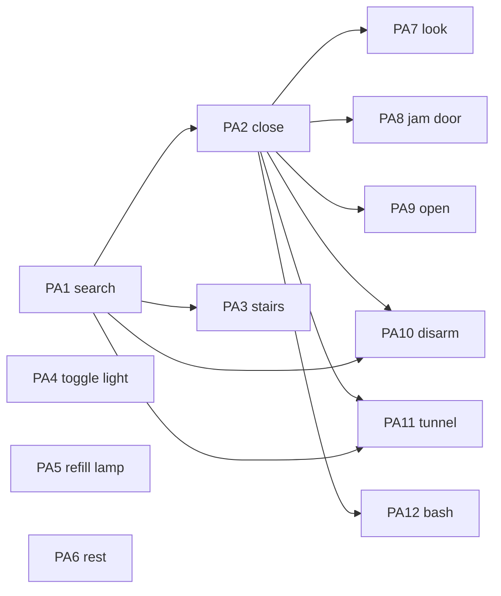

# Epic PA: Simple Player Actions

Ports the self-contained commands in `src/player_action/`. Attack, movement,
item use, and drop are in other epics. Back to the [backlog](../backlog.md).

All actions are called from [command.c](../../../src/main_loop/command.c).
`search` is also called from `move.c` and `tunnel.c`. Rust modules register
in [player_action.rs](../../../src/player_action.rs); C prototypes are in
[player_action.h](../../../src/player_action.h).

## Story Graph

## Stories

### PA1. Search (pathfinder: F-CELL)

Status: implemented. Depends on: none.
Size: S. Complexity: Medium. Agent: strong.

Implemented in [search.rs](../../../src/player_action/search.rs) and
[cell.rs](../../../src/dungeon/cell.rs), with one registration line each in
`player_action.rs` and `dungeon/mod.rs`. The C search implementation was removed.
Must not touch: `dungeon/trap/globals.rs`, `player_action/movement/globals.rs`.

Behavior: port `player_action_search(y, x, chance)` and keep its C symbol and
signature. No prompt. Scans the eight neighbors, rolls `randint(100)` per cell,
reveals unseen traps and secret doors through Rust `change_trap`, and marks
trapped chests known. Blind stops the search; confusion and no light reduce
the chance.

Foundation: F-CELL. Typed read and write access to a cave cell and its
`t_list` item, an `in_bounds` check, and a test helper that locks and resets a
small map. Expose only what search needs.

Acceptance checks:

* L1: a seeded search reveals an adjacent unseen trap and secret door, with
  the expected messages and `find_flag` cleared.
* L1: blind prints the blind message and changes nothing; confused and
  unlit cases reduce the chance as in C, including truncation.
* L1: map-edge positions skip out-of-bounds cells.
* `search.c` is deleted; `move.c`, `tunnel.c`, and `command.c` still link.

Out of scope: refactoring existing trap or movement accessors.

### PA2. Close Door (pathfinder: F-DIR-EDGE)

Status: implemented. Depends on: PA1.
Size: S. Complexity: Low. Agent: strong.

Implemented in [close.rs](../../../src/player_action/close.rs) and
[door.rs](../../../src/dungeon/door.rs), using the PA1 bounded cell access.
The C entry point retains only the direction prompt and delegates its target
through a thin Rust interop wrapper. Rust tests cover transitions, refusal
messages, redraw ordering, and invalid targets. Repeated L1 checks in
[headless_interaction.c](../../../tests/headless_interaction.c) exercise the
production C/Rust target boundary, item replacement, cave state, messages,
and redraw delivery. Interactive prompting and real terminal rendering
remain unverified.

Owns: [close.c](../../../src/player_action/close.c), a new Rust close module,
a new shared door module (for example `src/dungeon/door.rs`), and
registration lines.

Behavior: C keeps `player_action_close`, calls `d__get_dir`, then passes the
target to Rust. Rust closes an open door, refuses on a monster or broken door,
and updates the item and `cave.fopen`.

Foundation: F-DIR-EDGE. The prompt-shim pattern (C prompt, Rust takes the
target) and shared door state transitions that open, jam, bash, and tunnel
will reuse.

Acceptance checks:

* L1: closing an open door changes its item and `fopen`; messages match.
* L1: a monster in the way, a broken door, and a non-door target each leave
  state unchanged with the C message.
* `close.c` contains only the prompt shim.

### PA3. Ascend and Descend Stairs (fan-out)

Status: implemented. Depends on: PA1.
Size: S. Complexity: Low. Agent: light.

Implemented in [stairs.rs](../../../src/player_action/stairs.rs), using the
PA1 bounded cell access. The Rust module exports both C symbols
(`player_action_ascend_stairs`, `player_action_descend_stairs`) through a thin
interop wrapper, so the C callers in `command.c` are unchanged. Rust tests
cover normal and steep moves, the steep clamp at level zero, the single d3
roll for steep stairs, and the missing or wrong-stair message. Dispatch from
the `<` and `>` keys and real terminal output remain unverified by a headless
C-caller scenario.

Owns: a new Rust stairs module (with `globals.rs` and `interop.rs`) and
registration line. The C files `ascend_stairs.c` and `descend_stairs.c` are
deleted.

Behavior: no prompt. Checks the stair tile, changes `dun_level`, sets
`moria_flag`, and rolls `randint(3)` for steep stairs. Keep both C symbols.

Acceptance checks:

* L1: seeded up and down moves change level by the same amounts as C,
  including steep stairs.
* L1: not on stairs gives the C message and no change.
* Both C files are deleted.

### PA4. Toggle Light Source (fan-out)

Status: implemented. Depends on: none.
Size: S. Complexity: Medium. Agent: standard.

Implemented in [toggle_light_source.rs](../../../src/player_action/toggle_light_source.rs)
with local globals and interop modules and a registration line in
`player_action.rs`. The C implementation was deleted; the C symbol and
signature are unchanged. Rust tests cover both toggle directions, refusal
precedence, unchanged flags on refusal, and callback ordering. Repeated
headless C caller checks in
[headless_interaction.c](../../../tests/headless_interaction.c) cover flags,
messages, unchanged fuel and position, and C dungeon-lighting effects.
Real terminal rendering and toggle-specific save restoration remain unverified.

Behavior: no prompt or RNG. Toggles `player_flags.light_on` and
`player_light` based on the light slot, then calls C `prt_light_on`,
`msg_print`, and `dungeon_light_move` via local FFI.

Acceptance checks:

* L1: on, off, and no-light-source cases set flags as in C and emit the
  expected messages; `reset_flag` matches C.
* The C file is deleted.

Out of scope: porting `dungeon/light.c`.

### PA5. Refill Lamp (fan-out)

Status: open. Depends on: none.
Size: S. Complexity: Medium. Agent: standard.

Owns: [refill_lamp.c](../../../src/player_action/refill_lamp.c), a new Rust
module, registration line.

Behavior: no prompt. Finds a flask with `inventory_find_range`, caps lamp fuel,
destroys the flask with `inven_destroy`, and reports the remaining count.
Declare these C calls locally; F-ITEM (IU1) is not required.

Acceptance checks:

* L1: refill adds fuel up to the cap and consumes one flask.
* L1: no lamp and no flask each give the C message and no change.
* The C file is deleted.

### PA6. Rest (fan-out)

Status: open. Depends on: none.
Size: S. Complexity: Low. Agent: standard.

Owns: [rest.c](../../../src/player_action/rest.c), a new Rust module,
registration line.

Behavior: C keeps the `get_string` prompt and passes the string to Rust.
Rust parses `*` (rest until full, 20 turns) or a number, then sets rest
state, `turn_counter`, and the resting status, or sets `reset_flag` on zero.

Acceptance checks:

* L0: parsing `*`, a number, zero, and junk gives the same results as C
  `sscanf`, including leading digits.
* L1: a positive count turns search off and sets rest fields.
* `rest.c` contains only the prompt shim.

### PA7. Look (fan-out)

Status: open. Depends on: PA2.
Size: S. Complexity: Medium. Agent: standard.

Owns: [look.c](../../../src/player_action/look.c), a new Rust module,
registration line.

Behavior: C keeps the direction prompt. Rust walks the ray and reports
visible monsters and objects with the existing name helpers. Blind stops it.

Acceptance checks:

* L1: a monster, an object, and an empty ray each produce C's messages in
  order.
* `look.c` contains only the prompt shim.

### PA8. Jam Door (fan-out)

Status: open. Depends on: PA2.
Size: S. Complexity: Medium. Agent: standard.

Owns: [jam_door.c](../../../src/player_action/jam_door.c), a new Rust module,
registration line.

Behavior: C keeps the direction prompt. Rust uses the F-DIR-EDGE door helpers,
consumes one spike through local `inventory_find_range`/`inven_destroy`
declarations, and increments the door's `p1`.

Acceptance checks:

* L1: jamming a closed door consumes a spike and updates `p1`.
* L1: open door, no spikes, and monster cases match C.
* `jam_door.c` contains only the prompt shim.

### PA9. Open Door or Chest (fan-out)

Status: open. Depends on: PA2. Recommended: TR6.
Size: M. Complexity: High. Agent: strong.

Owns: [open.c](../../../src/player_action/open.c), a new Rust module,
registration line.

Behavior: C keeps the direction prompt. Rust handles lockpicking (RNG),
stuck doors, and chests: unlock, `trigger_trap`, treasure via
`monster_death` with the temporary `dun_level` override. Call
`trigger_trap` and `monster_death` through FFI; they stay C here.

Acceptance checks:

* L1: seeded lockpicking success and failure, a stuck door, and a locked,
  trapped, and empty chest each match C state and messages.
* L1: `dun_level` is restored after chest treasure.
* `open.c` contains only the prompt shim.

### PA10. Disarm Trap (fan-out)

Status: open. Depends on: PA1, PA2.
Size: S. Complexity: High. Agent: strong.

Owns: [disarm_trap.c](../../../src/player_action/disarm_trap.c), a new Rust
module, registration line.

Behavior: C keeps the direction prompt. Rust rolls disarm success, failure,
and the set-off branch, which moves the player onto the trap through C
`player_action_move`. Chest traps call C `trigger_trap`.

Acceptance checks:

* L1: seeded success frees the trap and grants experience; failure keeps it;
  set-off calls the move path. Messages match C.
* L1: blind and confused penalties match C.
* `disarm_trap.c` contains only the prompt shim.

### PA11. Tunnel (fan-out)

Status: open. Depends on: PA1, PA2.
Size: S. Complexity: High. Agent: strong.

Owns: [tunnel.c](../../../src/player_action/tunnel.c), a new Rust module,
registration line.

Behavior: C keeps the direction prompt. Rust handles wall difficulty by
terrain and weapon, rubble removal with a loot roll, and calls Rust search
afterward. `twall`, `place_random_dungeon_item`, and lighting stay C.

Acceptance checks:

* L1: seeded granite, magma, quartz, and rubble outcomes match C for a fixed
  weapon and stats.
* L1: monster and door targets match C messages.
* `tunnel.c` contains only the prompt shim.

### PA12. Bash (fan-out)

Status: open. Depends on: PA2.
Size: S. Complexity: High. Agent: strong.

Owns: [bash.c](../../../src/player_action/bash.c), a new Rust module,
registration line.

Behavior: C keeps the direction prompt. Rust handles door and chest bashing
and stun on failure. A monster target calls C `player_action_attack`, which
may still prompt with `get_yes_no`. Rust `managed_to_hit` uses `thread_rng`;
add a `_with_rng` path if tests need it.

Acceptance checks:

* L1: seeded door bash success, failure with stun, and chest outcomes match
  C.
* L1: a monster target delegates to attack without other state changes.
* `bash.c` contains only the prompt shim.
