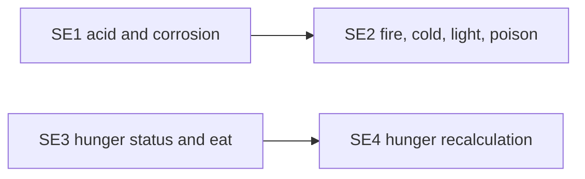

# Epic SE: Status Effects

Ports [effects.c](../../../src/effects.c) (219 lines) and
[player/hunger.c](../../../src/player/hunger.c) (175 lines). The two halves
are independent and can run in parallel. Back to the
[backlog](../backlog.md).

Callers that must keep linking: `effects` functions are called from
`creature.c`, `spells.c`, and `traps.c`. Hunger functions are called from
`main_loop.c`, `stores.c`, `eat.c`, `quaff_potion.c`, `chakra.c`,
`divine.c`, `enter_house.c`, and Rust `player/player_extern.rs`.

## Story Graph

## Stories

### SE1. Acid and Corrosion (pathfinder: F-DMG)

Status: open. Depends on: none.
Size: M. Complexity: Medium. Agent: strong.

Owns: `minus_ac`, `corrode_gas`, and `acid_dam` in `effects.c`; a new Rust
effects module; a new F-DMG module (for example under `src/player/`);
registration lines.

Behavior: port `minus_ac` (shared armor damage), `corrode_gas`, and
`acid_dam` with their C symbols. They mutate worn items' `toac`, write
`inven_temp`, roll RNG, call `inven_damage`, `take_hit`, and `py_bonuses`,
and redraw stats.

Foundation: F-DMG. Thin Rust wrappers around C `take_hit`, `py_bonuses`,
`prt_stat_block`, and `inven_damage`, each with a short contract (what it
mutates, whether it can kill). Expose only what these three functions use.

Acceptance checks:

* L1: seeded `minus_ac` picks the same slot and lowers `toac` as C;
  resistant and absent items behave as in C.
* L1: acid damage with and without resistance gives the C HP change and
  messages.
* `creature.c`, `spells.c`, and `traps.c` still link.

### SE2. Fire, Cold, Light, and Poison (fan-out)

Status: open. Depends on: SE1.
Size: S. Complexity: Medium. Agent: standard.

Owns: the remaining functions in `effects.c`, its header, and the Rust
effects module.

Behavior: port `fire_dam`, `cold_dam`, `light_dam`, and `poison_gas` using
F-DMG, then delete `effects.c`.

Acceptance checks:

* L1: each effect, with and without the matching resistance, gives the C
  damage, inventory damage call, and messages for a fixed seed.
* `effects.c` is deleted; callers still link.

### SE3. Hunger Status and Eating (fan-out)

Status: open. Depends on: none.
Size: S. Complexity: Medium. Agent: standard.

Owns: `player_hunger_status`, `player_hunger_set_status`, and
`player_hunger_eat` in `hunger.c`; a new Rust hunger module under
`src/player/`; registration line.

Behavior: port food thresholds, status flag updates, and eating
(`foodc` changes, bloated messages with `randint`). Keep all C symbols.
`player_extern.rs` already declares `player_hunger_status`; switch it to the
Rust function.

Acceptance checks:

* L0: every threshold boundary maps to the same status as C.
* L1: eating near each boundary updates `foodc`, status, and messages as C
  for a fixed seed.

### SE4. Hunger Recalculation (fan-out)

Status: open. Depends on: SE3.
Size: S. Complexity: High. Agent: strong.

Owns: the rest of `hunger.c`, its header, and the Rust hunger module.

Behavior: port `player_hunger_recalculate`: digestion by weight, fainting
(`randint`, paralysis, stationary move via C `player_action_move`), and
starvation death (`death`, `moria_flag`, `died_from`). Delete `hunger.c`.

Acceptance checks:

* L1: seeded fainting and starvation set the same flags and messages as C.
* L1: normal digestion matches C for a few weights.
* `hunger.c` is deleted; `main_loop.c` still links.

Out of scope: running the main loop.
