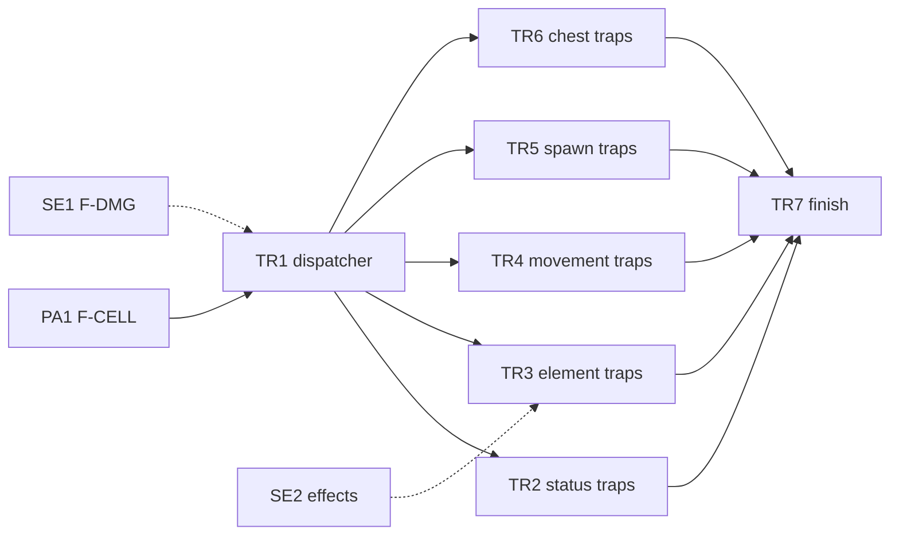

# Epic TR: Trap Activation

Ports the rest of [traps.c](../../../src/traps.c) (467 lines): the `hit_trap`
dispatcher, 22 `ht__*` handlers, town tile dispatch, and chest traps
(`trigger_trap`). Templates and placement are already Rust in
[dungeon/trap/](../../../src/dungeon/trap/). The C behavior every story must
preserve is in [C Behavior to Preserve](#c-behavior-to-preserve). Back to the
[backlog](../backlog.md).

Callers: `hit_trap` from [move.c](../../../src/player_action/move.c);
`trigger_trap` from `open.c` and `disarm_trap.c`. Both ABIs stay unchanged,
including `hit_trap(const long *y, const long *x)`.

## Story Graph



Fan-outs each own one Rust handler file and delete only their own `ht__*`
functions from `traps.c`.

The dispatcher goes first, not last, so the handlers can be ported in
parallel behind forwarding stubs. TR1 must characterize the dispatcher's
prelude and town dispatch before replacing it.

## C Behavior to Preserve

Verified against [traps.c](../../../src/traps.c) and
[traps.h](../../../src/traps.h) on 2026-10-09.

### ABI Contracts

```c
void hit_trap(const long *y, const long *x);
void trigger_trap(long y, long x);
void place_trap(long y, long x, long typ, long subval);
void change_trap(long y, long x);
void place_rubble(long y, long x);
```

* `hit_trap` takes pointers. A Rust export keeps `*const libc::c_long` and
  checks pointers before dereferencing.
* `trigger_trap` has no flags argument; it reads
  `t_list[cave[y][x].tptr].flags`.
* The existing Rust placement exports use `c_long`; `typ == 1` selects
  `TrapList::A` (unseen), anything else `TrapList::B` (seen). Open pits are
  always seen and subval 19 is always a closed door. Placement subvals are
  1-based (1-20). The wrappers cast to `usize` without validation; do not
  call them checked.
* Never define a Rust export while C still defines the same symbol.

### Dispatcher Prelude

Before dispatch, C `hit_trap` stops searching and resting, calls
`change_trap`, redraws the player's tile, clears `find_flag`, and rolls the
item's damage string. Keep this order.

### Dungeon Handlers

| Subval | C handler | Story |
| --- | --- | --- |
| 1 | `ht__open_pit` | TR1 |
| 2 | `ht__arrow` | TR1 |
| 3 | `ht__covered_pit` | TR4 |
| 4 | `ht__trap_door` | TR4 |
| 5 | `ht__sleep_gas` | TR2 |
| 6 | `ht__hidden_object` | TR5 |
| 7 | `ht__str_dart` | TR2 |
| 8 | `ht__teleport` | TR4 |
| 9 | `ht__rockfall` | TR5 |
| 10 | `ht__corrode_gas` | TR3 |
| 11 | `ht__summon_monster` | TR5 |
| 12 | `ht__fire` | TR3 |
| 13 | `ht__acid` | TR3 |
| 14 | `ht__poison_gas` | TR3 |
| 15 | `ht__blind_gas` | TR2 |
| 16 | `ht__confuse_gas` | TR2 |
| 17 | `ht__slow_dart` | TR2 |
| 18 | `ht__con_dart` | TR2 |
| 19 | `ht__secret_door` (empty; visibility handled earlier) | TR1 |
| 20 | `ht__chute` | TR4 |
| 99 | `ht__scare_monster` (empty for the player) | TR1 |
| 123 | `ht__whirlpool` | TR4 |

The covered pit calls `place_trap(y, x, 2, 1)` only in the non-feather-fall
branch, after damage.

### Town and Special Tiles

| Subval | C behavior |
| --- | --- |
| 101-107, 109, 110, 113, 116, 118 | `check_store_hours_and_enter` (general store, armory, weaponsmith, temple, alchemist, magic shop, inn, library, music shop, gem shop, deli, black market) |
| 108 | Trading-post hours, then `enter_trading_post` |
| 111 | Insurance closed: message only |
| 112 | Bank hours, then `enter_bank` |
| 114 | Money-changer hours, then a redirect-to-bank message |
| 115 | Casino hours, then `enter_casino` |
| 117 | `enter_fortress` |
| 119 | No case; falls through to the unknown-value message |
| 120-122 | `enter_house(*y, *x)` |

Unknown values print `You got lucky: unknown trap value.` Do not collapse
the special entrances into one generic store call.

### Chest Traps

`trigger_trap` reads the flags once and checks each bit with a separate
`if`, in this order. Combined flags apply all branches, including summons
after an explosion.

| Flag | Behavior |
| --- | --- |
| `0x10` | Strength-loss needle; damage if the stat loss succeeds |
| `0x20` | Poison needle damage and poison duration |
| `0x40` | Paralysis gas, unless free action |
| `0x80` | Delete the chest and apply explosion damage |
| `0x100` | Three summon attempts, water or land by terrain |

## Stories

### TR1. Rust Trap Dispatcher (pathfinder: F-TRAP-DISPATCH)

Status: open. Depends on: PA1. Recommended: SE1.
Size: M. Complexity: High. Agent: strong.

Owns: `traps.c` (dispatcher removal, making handlers non-static),
[traps.h](../../../src/traps.h), new files under `src/dungeon/trap/` for the
dispatcher and one handler file per group, and the registration line in
`dungeon/trap/mod.rs`.

Behavior: move `hit_trap` to Rust with the same pointer ABI and checked
dereferences. Keep the C prelude order: stop rest and search, `change_trap`,
redraw the tile, clear `find_flag`, then roll the item's damage with C
`damroll`. Town and special tiles (stores, trading post, bank, casino,
fortress, house) dispatch to their C entry functions. Port `ht__open_pit` and
`ht__arrow` to prove the handler pattern.

Foundation: F-TRAP-DISPATCH. Create group files for TR2-TR5 that forward to
the remaining C handlers, so fan-outs never edit the dispatcher. Use F-DMG
for damage if SE1 is done; otherwise declare `take_hit` locally.

Acceptance checks:

* L1: each dungeon subval reaches its handler (forwarding or Rust), with
  the prelude side effects in C order.
* L1: open pit and arrow damage, feather fall, and miss cases match C.
* L1: town tile subvals call the right entry function, including 111, 114,
  missing 119, and unknown values; test with link-time doubles, not real
  stores.
* Null pointers are rejected without dereferencing.

Out of scope: porting store, bank, casino, fortress, or house entry.

### TR2. Status Traps (fan-out)

Status: open. Depends on: TR1.
Size: S. Complexity: Medium. Agent: standard.

Owns: the status-trap handler file and the matching `ht__*` functions in
`traps.c`.

Behavior: port sleep gas, blind gas, confuse gas, slow dart, strength dart,
and constitution dart. Includes free action, sustain, and `lose_stat` (C
`spells.c`) branches.

Acceptance checks:

* L1: each trap, with and without its resistance, sets the same flags and
  messages as C for a fixed seed.

### TR3. Element Traps (fan-out)

Status: open. Depends on: TR1. Recommended: SE2.
Size: S. Complexity: Low. Agent: standard.

Owns: the element-trap handler file and the matching `ht__*` functions.

Behavior: port fire, acid, corrode gas, and poison gas. Each calls an
`effects` function; call Rust if SE2 is done, otherwise C.

Acceptance checks:

* L1: each trap calls its effect with the C damage and message.

### TR4. Movement and Level Traps (fan-out)

Status: open. Depends on: TR1.
Size: S. Complexity: High. Agent: strong.

Owns: the movement-trap handler file and the matching `ht__*` functions.

Behavior: port covered pit, trap door, teleport, chute, and whirlpool. The
covered pit calls `place_trap(y, x, 2, 1)` only in the non-feather-fall
branch, after damage. Level changes set `dun_level` and `moria_flag`;
teleport sets `teleport_flag`.

Acceptance checks:

* L1: each trap's level, flag, and position changes match C, with and without
  feather fall.
* L1: the covered pit is replaced only in the non-feather-fall branch.

### TR5. Spawning Traps (fan-out)

Status: open. Depends on: TR1.
Size: S. Complexity: Medium. Agent: standard.

Owns: the spawn-trap handler file and the matching `ht__*` functions.

Behavior: port hidden object, summon monster, and rockfall. Call C
`place_random_dungeon_item`, `pusht`, `delete_object`, and the monster summon
functions via FFI. Rockfall uses Rust `place_rubble`.

Acceptance checks:

* L1: seeded summon count and calls match C; use link-time doubles for
  monster placement.
* L1: hidden object and rockfall leave the cell and `t_list` as in C.

### TR6. Chest Traps (fan-out)

Status: open. Depends on: TR1.
Size: S. Complexity: Medium. Agent: standard.

Owns: `trigger_trap` in `traps.c`, a new chest-trap Rust file, and its
prototype in `traps.h`.

Behavior: port `trigger_trap(long y, long x)`. Reads chest flags from
`t_list[cave[y][x].tptr].flags`; applies lose-strength, poison, paralysis,
explode, and summon in C order.

Acceptance checks:

* L1: each flag bit, alone and combined, matches C state and messages for a
  fixed seed.
* `open.c` and `disarm_trap.c` still link without changes.

### TR7. Remove traps.c (finish)

Status: open. Depends on: TR2-TR6.
Size: S. Complexity: Low. Agent: light.

Owns: `traps.c`, `traps.h`, and the forwarding code.

Behavior: delete `traps.c` once empty, remove forwarding stubs, and keep
`traps.h` prototypes for C callers.

Acceptance checks:

* `make check` passes after a clean build.
* No `ht__` symbols remain in C.
