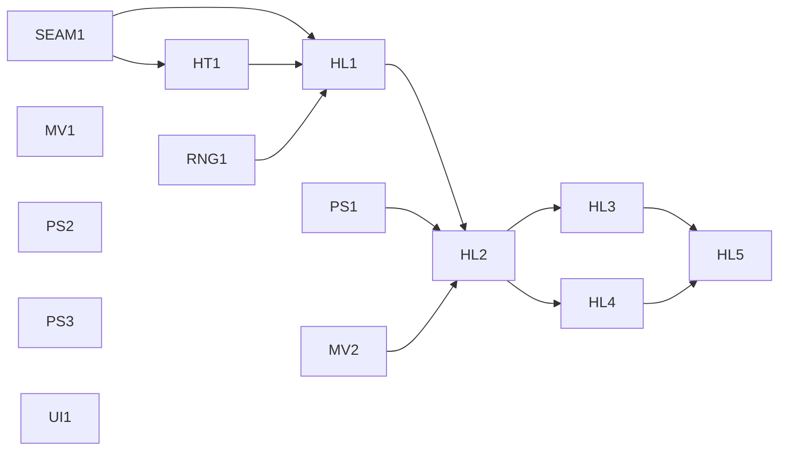

# Testing Roadmap

Status: tasks 1–4 and the decision part of task 5 are done. A headless gameplay
harness is **not implemented**. Open work is split into parallel task cards in
[Open Task Cards](#open-task-cards). Existing unit tests and successful linking
are useful evidence, but do not establish that a player can complete a gameplay
workflow.

## Current Verification

The `make check` gate runs:

```sh
cargo fmt --check
cargo clippy --all-targets
cargo test
make
make test-movement
make test-messages
```

This checks formatting, Rust linting and tests, and the full C/Rust build and
link, plus terminal-free C movement and message boundary checks. It proves the tested slices
and link, not full gameplay or headless turns.
The clean gate passes locally on macOS. CI runner results remain unverified.
Existing Clippy warnings are non-blocking. Six scoped legacy lint allowances
preserve behavior; they are not evidence that those paths are safe. See the
[build instructions](../README.md).

Before changing the allowed legacy paths, add focused tests for ability input,
flag-width assumptions, RNG rounding, terminal input-buffer validity, and C
string-pointer contracts. In particular, terminal input currently casts an
immutable buffer to a mutable C pointer; the allowance does not make that safe.

## Verification Levels

| Level | Scope | Required evidence |
| --- | --- | --- |
| L0: pure logic | Explicit inputs and outputs; injected or seeded RNG; no globals, terminal, filesystem, or clock. | Deterministic assertions on results and invariants, including relevant boundaries. |
| L1: isolated globals | Small integration slices that still use shared C/Rust state. | Serialize every test sharing that state, establish initial state, and restore it even on failure; repeat runs without order dependence. No real terminal or personal files. |
| L2: save fixtures | Compatibility and round trips through actual save record types using sanitized, tracked JSON. | Deserialize known existing-format data, assert meaningful fields, serialize and deserialize again, and compare semantic values. Invalid input fails predictably. |
| L3: headless turns | Execute bounded turns through production game logic with controlled state, commands, RNG, persistence, and messages. | Assert observable state changes and ordered messages without curses, interactive input, wall-clock dependencies, or personal files. |

These levels describe evidence, not a claim that every level exists today.
Choose the smallest level that covers a change; a compile-only check is not a
substitute for a behavioral assertion.

## Completed Work

Each entry keeps only what the next agent needs: where the code lives and
which gaps remain. Gaps that have a task card below reference its ID.

* **1. Save JSON compatibility (L2).** Sanitized fixture
  `tests/fixtures/save_record_v1.json`; pure `parse_save`/`serialize_save`
  tests are inline in [save.rs](../src/save/save.rs). Debug-build `SaveRecord`
  deserialization needs more than 2 MiB of stack (tests use
  `with_large_stack`). Gap: invalid `identified` entries panic (PS2).
* **2. Persistence injection (L0/L1).** Crate-private
  [PersistenceEngine](../src/persistence/main.rs) covers master records and
  typed character load/write/delete/list; production stays file-backed
  ([filestorage.rs](../src/persistence/filestorage.rs)). The JSON-backed
  in-memory engine ([memory.rs](../src/persistence/memory.rs)) is
  `#[cfg(test)]` only. Gaps: applying records to globals (PS1), non-atomic
  writes (PS3), empty character-menu navigation (UI1).
* **3. Message stream capture (L0/L1).** [message.rs](../src/message.rs)
  provides `capture_messages()` (Rust guard) and the
  `C_message_capture_begin`/`end`/`count`/`get` C API. Capture is process-wide:
  the newest live capture wins and dropping it restores the previous one, even
  on panic. Captured `msg_print` calls skip rendering and the ` -more-` prompt.
  The 50-message history is unchanged. `make test-messages` uses `-D` macro
  doubles for `io.c` terminal calls. Other input prompts are not bypassed.
* **4. Item generation RNG injection (L0).** Dungeon-level item generation
  takes an injected rand 0.4 RNG through every roll
  ([generate_item.rs](../src/generate_item/generate_item.rs)). Zero dungeon
  level deliberately returns item level zero without consuming RNG.
* **5. Minimal state slice (L0/L1), decision part.**
  [movement/step.rs](../src/player_action/movement/step.rs) resolves keypad
  steps, monster precedence, obstacles, and `consumes_turn` against explicit
  state and a borrowed map. Confusion uses an injected RNG with legacy parity.
  The C caller ([move.c](../src/player_action/move.c)) keeps its side-effect
  order. `make test-movement` covers walls and map edges. `turn_counter` stays
  in the main loop and counts command attempts. Gaps: owned successful-move
  transition (MV1), C-caller successful move (MV2).

<<<<<<< Updated upstream
Status: done. Fixture: `tests/fixtures/save_record_v1.json`; tests are inline in
[save.rs](../src/save/save.rs). Invalid `identified` item types and subtypes,
including removed and non-item types, now return decode errors rather than
panicking; subtype conversion returns `None` for unsupported values. C callers
and terminal error display remain unverified.
||||||| Stash base
Status: done. Fixture: `tests/fixtures/save_record_v1.json`; tests are inline in
[save.rs](../src/save/save.rs). Known gap: invalid `identified` entries panic
during deserialization instead of returning an error.
=======
## Delegating Open Tasks
>>>>>>> Stashed changes

The open work is split into task cards with stable IDs. Each card states its
dependencies, the files it owns, and its acceptance checks. Hand one card to
one agent with the [delegated-task prompt](../.github/prompts/delegated-task.prompt.md),
pasting the card as the task contract.

Rules for parallel agents:

* **One task, one branch or worktree.** Do not combine cards.
* **Edit only owned files.** If a change needs a file the card does not own,
  stop and report it as a scope change. Do not edit another card's files.
* **Shared files have fixed rules:**
  * `CHANGELOG.md`: add one bullet under **Unreleased**. When merging, keep
    both sides of any conflict.
  * This roadmap: update only your own card's `Status:` line.
  * `Makefile`: add only your own target and its single line in `check`. Do
    not change other recipes.
* **Report** the RED failure, the GREEN result, `make check`, and any
  unverified boundaries, as the prompt requires. The coordinator merges one
  branch at a time and reruns `make check` after each merge.
* **Be honest about coverage.** No card except HL5 may claim headless gameplay
  coverage.

### Dependency Graph



| Wave | Cards that can run concurrently |
| --- | --- |
| 1 | SEAM1, RNG1, PS1, PS2, PS3, MV1, MV2, UI1 |
| 2 | HT1 |
| 3 | HL1 |
| 4 | HL2 |
| 5 | HL3, HL4 |
| 6 | HL5 |

MV1, PS2, PS3, and UI1 are not on the headless critical path, so any agent can
pick them up at any time.

## Open Task Cards

### MV1. Owned Successful-Move Transition (L0)

Status: open. Depends on: none. This closes the remaining task 5 acceptance
check.

Owns: [step.rs](../src/player_action/movement/step.rs) and
`src/player_action/movement/mod.rs`.
Must not touch: `move.c`, `globals.rs`, `interop.rs`, the main loop.

Behavior: applying a `StepOutcome` to explicit, owned state moves the player
and its occupancy on `Moved`, and leaves state unchanged for every other
outcome. Choose a design (for example, a mutable occupancy trait or returning
a new state) and explain it in the report.

Acceptance checks:

* A legal move updates the position, clears the old cell, occupies the new
  cell, and consumes a turn.
* Blocked, attack, and out-of-bounds outcomes leave position and occupancy
  unchanged.
* Two independent states or maps do not affect each other.

Out of scope: wiring the transition into the C adapter (production keeps
`move_creature`), `turn_counter`, find/run, lighting, search, pickup, traps.

### MV2. C Caller: Successful Open-Floor Move (L1)

Status: open. Depends on: none.

Owns: [tests/movement_ffi.c](../tests/movement_ffi.c) and the `test-movement`
recipe in the `Makefile`.
Must not touch: `move.c` or other production sources.

Behavior: run `player_action_move` onto open floor through the real C caller.
Today the harness covers only walls and edges.

Acceptance checks:

* `char_row`/`char_col` update, `cptr` moves from the old cell to the new one,
  and `reset_flag` stays false. Run the check twice from a reset state.
* The setup avoids incidental side effects and documents why. For example,
  `player_flags.blind >= 1` skips the `randint(player_fos())` search roll and
  room lighting in [move.c](../src/player_action/move.c), and a target cell with
  no item skips `carry`.

If the success path needs curses (panel or light drawing) to run, stop and
report the exact calls. Terminal doubles belong to HT1.

### SEAM1. Headless-Turn Seam Inventory (Research)

Status: open. Depends on: none. Research only, no code changes.

Owns: `docs/migration/headless-turn-seams.md` (new).

Deliverable: an inventory of what keeps one iteration of `main_loop__0`
([main_loop.c](../src/main_loop/main_loop.c)) from running headless. Cover the
`command()` dispatch ([command.c](../src/main_loop/command.c)) for movement
keys and one candidate interaction. List every call reaching:

* terminal drawing (`prt_*`, `draw_cave`, `print_null`, `erase_line`);
* input (`inkey`, `inkey_delay` in resting, other prompts);
* wall clock and files (`time()` and `KICKOUT_FILE` in
  [kickout.c](../src/kickout.c), and any others found);
* the global RNG (`randint` and related), process exit, and death handling.

Acceptance checks:

* Each entry gives the file and line, states whether it is reached under a
  stated minimal setup, and proposes a seam. Options: avoid it through state
  setup, a link-time double, a `-D` macro as in `test-messages`, or a function
  pointer.
* Recommend one HL3 interaction that changes HP or inventory, and list the
  minimal global state that interaction needs.
* Mark each claim as verified by reading or as an assumption.

### RNG1. Seedable C-Facing RNG (L1)

Status: done. Depends on: none.

Owns: `src/rng/` and [random_extern.rs](../src/random_extern.rs), plus
`src/random.h` if a C API is added.

Behavior: C `randint`/`rand_rep`/`randnor` call `rand::thread_rng()`
([random.rs](../src/rng/random.rs)) and cannot be seeded. Add a scoped, seeded
override that follows the message-capture pattern: a Rust guard plus a paired
C begin/end, where the newest override wins and dropping it restores the
previous one, even on panic. The production default stays unchanged.

Acceptance checks:

* The same seed gives identical sequences through the public `randint`,
  `rand_rep`, and `randnor`.
* The default is restored after the guard drops, including on panic. Nesting
  works. The override is thread-local, so tests that share it need no
  serialization.
* The `*_with_rng` functions and their callers are unchanged.

Out of scope: upgrading rand, migrating callers, `time()` calls.

### HT1. Headless C Terminal Doubles (L1)

Status: open. Depends on: SEAM1.

Owns: `tests/support/` (new), [tests/message_ffi.c](../tests/message_ffi.c),
and the `test-messages` recipe in the `Makefile`.
Must not touch: production `io.c`/`term.c`, unless SEAM1 recommends it and
the coordinator approves.

Behavior: extract the `test-messages` doubles into reusable support. Provide
scripted key input that fails, rather than blocks, when exhausted, plus drawing
no-ops or recorders. Cover the calls SEAM1 marks as required for HL1.

Acceptance checks:

* `make test-messages` passes after migration with the same assertions.
* Exhausted scripted input fails predictably instead of hanging.
* An unexpected prompt fails loudly.

### PS1. Apply a Save Record to Globals (L1/L2)

Status: open. Depends on: none.

Owns: `src/save/`, a new C harness under `tests/`, and its own `Makefile`
target.
Must not touch: [identification.rs](../src/identification.rs) (owned by PS2)
or `src/persistence/`.

Behavior: `load_character` in [save.rs](../src/save/save.rs) loads through
persistence and then applies records to C/Rust globals through the
`set_record` functions. Separate the apply step so that a parsed `SaveRecord`
can be applied and read back without disk, the master file, or a terminal.
The test needs a C harness, because `set_record` writes C globals and calls
`tlink`/`popt`.

Acceptance checks:

* Applying the fixture to globals and reading it back with the `record()`
  functions gives the same semantic values for player, inventory, equipment,
  town, dungeon, identification, and monsters.
* A second scenario starts from reset state, and repeated runs pass.
* The production load path behaves the same as before.
* Mismatched cave data behavior (`debug::fatal` in `load_cave`) is documented,
  not changed.

Note that deserialization in a debug build needs a large stack (see task 1).

### PS2. Invalid Identified Entries Return Errors (L0)

Status: open. Depends on: none.

Owns: [identification.rs](../src/identification.rs).

Behavior: the `IdentifiedSubTypes` `Deserialize` implementation panics on an
invalid type or subtype. It should return a serde error instead.

Acceptance checks:

* An invalid type and an invalid subtype each return an error with context,
  without panicking.
* The tracked fixture still parses.
* Serialized output is unchanged.

### PS3. Atomic Character-Save Writes (L1)

Status: open. Depends on: none.

Owns: [filestorage.rs](../src/persistence/filestorage.rs).

Behavior: write to a temporary file in the same directory, then rename it over
the save, so that a failed write cannot corrupt an existing save.

Acceptance checks:

* Tests run in a temporary directory and never touch the real save directory.
* A failed write leaves the previous contents intact.
* A successful write replaces the save and leaves no temporary file behind.

If the save directory cannot be injected without changing `PersistenceEngine`
in `main.rs`, stop and present options. That file is not owned by this card.

### UI1. Character Menu Empty-List Navigation (L0)

Status: open. Depends on: none.

Owns: [menu.rs](../src/pregame/menu.rs) and
[the bug note](bugs/character-menu-empty-list.md).

Behavior and acceptance checks: as listed in the bug note. Extract selection
movement into pure logic. Cover empty, single-entry, first-entry, and
last-entry lists, plus lists with more than 255 entries. Pressing down on an
empty list leaves the index at zero.

### HL1. Bounded Main-Loop Entry (L1)

Status: open. Depends on: SEAM1, HT1, RNG1.

Owns: [main_loop.c](../src/main_loop/main_loop.c), `main_loop.h`, a new
`tests/headless_turn.c`, and a new `test-headless` target in the `Makefile`.

Behavior: extract only enough of `main_loop__0` to run with an injected
command source and a turn limit. In production, the loop still reads commands
with `inkey()`.

Acceptance checks:

* When the scripted commands run out, the loop returns without waiting for
  input.
* When the turn limit is reached, the loop returns.
* Neither case initializes curses, and injected dependencies are restored
  between scenarios.
* The interactive build (`make omoria`) and the existing C harnesses still
  pass.

Out of scope: rewriting the `d__update_*` chain or porting the loop to Rust.

### HL2. Headless Movement Scenario (L3)

Status: open. Depends on: HL1, PS1, MV2.

Owns: `tests/headless_turn.c`, `tests/support/headless_scenario.{c,h}` (new),
and `tests/fixtures/headless_*.json` (new).

Behavior: load a sanitized fixture through PS1's apply path, seed RNG1, and
run scripted movement commands through the production `command()` dispatch.

Acceptance checks:

* A successful move changes position.
* A blocked move keeps the position and follows the existing semantics:
  `reset_flag` requests another command within the same game turn.
* Captured messages match exactly, in order.

### HL3. Headless Interaction Scenario (L3)

Status: open. Depends on: HL2. Can run in parallel with HL4.

Owns: `tests/headless_interaction.c` (new) and its own `Makefile` target. It
reads, but does not edit, HL2's `tests/support/headless_scenario.*`.

Behavior and acceptance checks: run the interaction SEAM1 recommended. It must
change HP or inventory, with a fixed setup so results are stable, and emit the
expected messages in order.

### HL4. Headless Save/Reload Scenario (L3)

Status: open. Depends on: HL2 and PS1. Can run in parallel with HL3.

Owns: `tests/headless_persistence.c` (new), its own `Makefile` target, and
`src/persistence/memory.rs` together with its `cfg` gate in
`src/persistence/mod.rs`. The in-memory engine is test-only today, and the
harness needs it.

Behavior and acceptance checks: run turns, save to the in-memory engine,
reload, and assert that position, HP, and inventory are retained. Real disk
and personal files are never touched.

### HL5. Repeatability and Gate (L3)

Status: open. Depends on: HL3, HL4.

Owns: the `Makefile` `check` target and the **Status** and
**Current Verification** sections of this roadmap.

Acceptance checks:

* Running each headless scenario twice in one process gives identical results.
* `make check` runs all headless targets.
* Only then, update this roadmap to state that bounded headless gameplay
  coverage exists, and list what it does not cover.